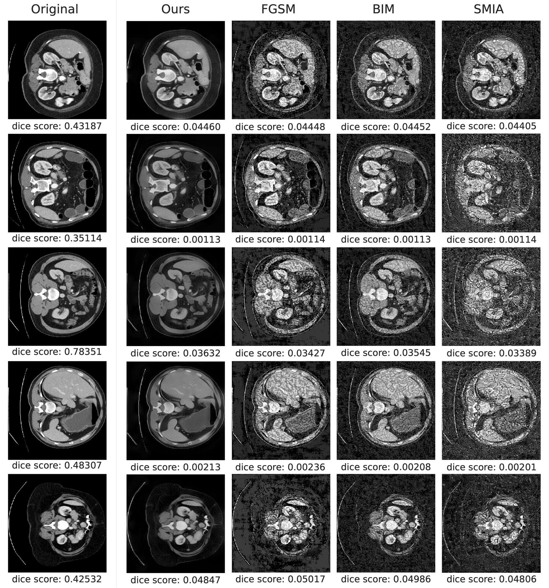

# Adversarial Attacks on Medical Images via Distortion of Feature Distribution

Official Pytorch code for ["Adversarial Attack Medical Images by Distortion of Feature Distribution"]() 



## Introduction:
**Motivation:** Deep learning-based segmentation models have made a profound impact on medical procedures, with U-Net based computed tomography (CT) segmentation models exhibiting remarkable performance. Yet, even with these advances, these models are found to be vulnerable to adversarial attacks, a problem that equally affects automatic CT segmentation models. Conventional adversarial attacks typically rely on adding noise or perturbations, leading to a compromise between the success rate of the attack and its perceptibility.

**Method:** In this study, we challenge this paradigm and introduce a novel generation of adversarial attacks aimed at deceiving both the target segmentation model and medical practitioners. We focus on cases where clinical diagnosis relies primarily on organ shape rather than texture. Our approach, unlike conventional methods, aims to deceive a target model by altering the texture distribution of an organ while retaining its shape. We employ a real-time style transfer method, known as the texture reformer, which uses adaptive instance normalization (AdaIN) to change an image's texture. To induce distortion, we modify the AdaIN, which typically aligns the source and target image distributions.

**Results:** Through rigorous experiments, we demonstrate the effectiveness of our approach. Our adversarial samples successfully pass as realistic in blind tests conducted with physicians, surpassing the effectiveness of contemporary techniques. This innovative methodology not only offers a robust tool for benchmarking and validating automated CT segmentation systems but also serves as a potent mechanism for data augmentation, thereby enhancing model generalization. This dual capability significantly bolsters advancements in the field of medical imaging.

**Contact:** nongaussian@hanyang.ac.kr.


## Environment:
- Python 3.9
- Pytorch 2.0.1
- Torchvision 0.15.2
- Pillow 9.3.0
- Numpy 1.24.1
- opencv-python 4.8.0

## Getting Started:
#### Step 1: Clone this repo

`git clone https://github.com/hyerica-bdml/adversarial-attack-distorting-distribution`  
`cd adversarial-attack-distorting-distribution`

#### Step 2: Prepare models

- Download the pre-trained auto-encoder models from this [google drive](). Unzip and place them at path `weights/`.

#### Step 3: Run transfer script

- For distorting distribution, you only need to input two images: the input image -image, the organ label of input image -label, like follows:
`python main.py -image inputs/image.npy -label inputs/label.npy`


## Script Parameters:
Specify inputs and outputs

- `-imgf` : File path to the image.
- `-lblf` : File path to the label.
- `-outf` : Folder to save output images.

Runtime controls

- `-coarse_alpha` : Hyperparameter to blend transformed feature with content feature in coarse level (level 5).
- `-fine_alpha` : Hyperparameter to blend transformed feature with content feature in fine level (level 4).
- `-concat_weight` : Hyperparameter to control the semantic guidance/awareness weight for -semantic concat mode and -semantic concat_ds mode, range 0-inf.
- `-coarse_psize` : Patch size in coarse level (level 5), 0 means using global view.
- `-fine_psize` : Patch size in fine level (level 4).
- `-enhance_alpha` : Hyperparameter to control the enhancement degree in level 3, level 2, and level 1.
- `-noise_mu` : Hyperparameter to control the noise rate of mean in AdaIN.
- `-noise_sigma` : Hyperparameter to control the noise rate of std in AdaIN.

## Citation:
If you find this code useful for your research, please cite the paper:
```
@inproceedings{

}
```

## Acknowledgement:
We refer to python codes from [Texture-Reformer](https://github.com/EndyWon/Texture-Reformer) and [Collaborative-Distillation](https://github.com/MingSun-Tse/Collaborative-Distillation). Great thanks to them!
Inputs are taken from [Multi-Atlas Labeling Beyond the Cranial Vault](https://www.synapse.org/#!Synapse:syn3193805/wiki/217789).
